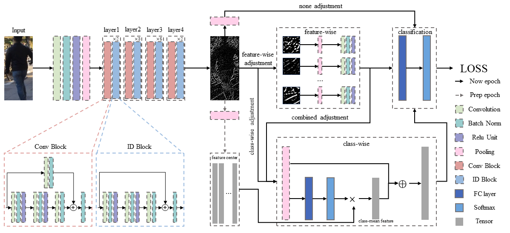

### Preparation

#### Requirements: Python=3.6 and Pytorch>=1.0.0

1. Install [Pytorch](http://pytorch.org/)

2. Download dataset

   - Market-1501 [[BaiduYun]](http://pan.baidu.com/s/1ntIi2Op) [[GoogleDriver]](https://drive.google.com/file/d/0B8-rUzbwVRk0c054eEozWG9COHM/view?usp=sharing) CamStyle (generated by CycleGAN) [[GoogleDriver]](https://drive.google.com/open?id=1klY3nBS2sD4pxcyUbSlhtfTk9ButMNW1) [[BaiduYun]](https://pan.baidu.com/s/1NHv1UfI9bKo1XrDx8g70ow) (password: 6bu4)
   
   - DukeMTMC-reID [[BaiduYun]](https://pan.baidu.com/s/1jS0XM7Var5nQGcbf9xUztw) (password: bhbh) [[GoogleDriver]](https://drive.google.com/open?id=1jjE85dRCMOgRtvJ5RQV9-Afs-2_5dY3O) CamStyle (generated by CycleGAN) [[GoogleDriver]](https://drive.google.com/open?id=1tNc-7C3mpSFa_xOti2PmUVXTEiqmJlUI) [[BaiduYun]](https://pan.baidu.com/s/1NHv1UfI9bKo1XrDx8g70ow) (password: 6bu4)
   
   - MSMT17 + CamStyle (generated by StarGAN) [[BaiduYun]](https://pan.baidu.com/s/1NHv1UfI9bKo1XrDx8g70ow) (password: 6bu4) [[GoogleDriver]](https://drive.google.com/open?id=11I7p0Dr-TCC9TnvY8rWp0B47gCB3K0T4) We reformulate the structure of MSMT17 the same as Market-1501.
   
   - Unzip each dataset and corresponding CamStyle under 'IECN/data/'
   
   Ensure the File structure is as follow:
   
   ```
   IECN/data    
   │
   └───market OR duke OR msmt17
      │   
      └───bounding_box_train
      │   
      └───bounding_box_test
      │   
      └───bounding_box_train_camstyle
      | 
      └───query
   ```

### Training and test domain adaptation model for person re-ID

  ```Shell
  # Feature-wise Adjustment
  # For Duke
  python adjustment_main.py -d duke -t duke --logs-dir logs/duke-ISReID --adjustment feature-wise
  # For Market-1501
  python adjustment_main.py -d market -t market --logs-dir logs/duke-ISReID --adjustment feature-wise
  # For CUHK03
  python adjustment_main.py -d cuhk03 -t cuhk03 --logs-dir logs/duke-ISReID --adjustment feature-wise
  # For MSMT17
  python adjustment_main.py -s msmt17 -t msmt17 --logs-dir logs/duke-ISReID --re 0 --adjustment feature-wise
  
  # Class-wise Adjustment
  # For Duke to Market-1501
  # For Duke
  python adjustment_main.py -d duke -t duke --logs-dir logs/duke-ISReID --adjustment class-wise
  # For Market-1501
  python adjustment_main.py -d market -t market --logs-dir logs/duke-ISReID --adjustment class-wise
  # For CUHK03
  python adjustment_main.py -d cuhk03 -t cuhk03 --logs-dir logs/duke-ISReID --adjustment class-wise
  # For MSMT17
  python adjustment_main.py -s msmt17 -t msmt17 --logs-dir logs/duke-ISReID --re 0 --adjustment class-wise
  
  # Combined Adjustment
  # For Duke
  python adjustment_main.py -d duke -t duke --logs-dir logs/duke-ISReID --adjustment Combined
  # For Market-1501
  python adjustment_main.py -d market -t market --logs-dir logs/duke-ISReID --adjustment Combined
  # For CUHK03
  python adjustment_main.py -d cuhk03 -t cuhk03 --logs-dir logs/duke-ISReID --adjustment Combined
  # For MSMT17
  python adjustment_main.py -s msmt17 -t msmt17 --logs-dir logs/duke-ISReID --re 0 --adjustment Combined
  ```


### Results

 


       
### References

- Our code is conducted based on [ECN](https://github.com/zhunzhong07/ECN)


### Contact me

If you have any questions about this code, please do not hesitate to contact me.

